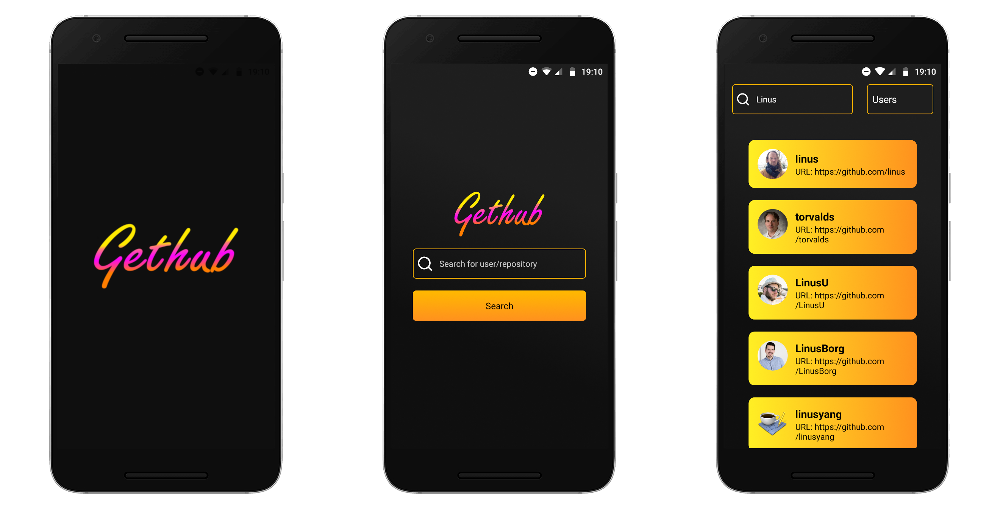

<h1 align="center">
    
</h1>

  

    An application used for seeing user information and repositories from GitHub.

## :rocket: Technologies

This project was developed with the following technologies:

- [ESLint](https://eslint.org/)
- [Expo](https://expo.io/)
- [React Native](https://reactnative.dev/)

Extras:

- [Axios](https://github.com/axios/axios)
- [React Navigation](https://reactnavigation.org/)

## :thinking: Contributing

1. Fork this repository.
2. Create a branch with your feature (`git checkout -b my-feature`).
3. Commit your changes (`git commit -m 'Add my feature!'`).
4. Push to your branch (`git push origin my-feature`).
5. Create a pull request.

## :memo: License

This project is under the MIT license. See the [LICENSE](LICENSE.md) file for more details.

## :heart: Contributors

